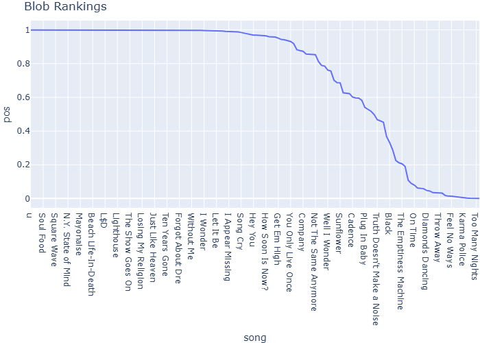

# Song Scraping and Lyric Sentiment Analysis


## Overview

This project scrapes song data from public Apple Music playlists,
performs sentiment analysis using several different methods (VADER,
TextBlob, and Transformer models), and reorders playlists from happiest
to saddest songs. The project uses the Genius API to extract lyrics and
provides visualizations of sentiment rankings.

## Usage Pipeline

The project includes a complete pipeline function that handles all steps
from playlist URL to sentiment-ranked resul Creating functions and
pipeline for different playlists:

### Example Usage

``` python
test_url = "https://music.apple.com/us/playlist/best-of-the-best/pl.u-XkD0YzMfDYd17j9"

# Run the complete analysis pipeline
fig, sorted_df = analyze_playlist(test_url, model='textblob')
```

### Results Visualization


|  | lyrics | song | artist | classification | pos | neg |
|----|----|----|----|----|----|----|
| 38 | Ah! Ah! Ah! Loving you is complicated ... | u | Kendrick Lamar | pos | 1.0 | 5.409459e-14 |
| 111 | Calling Apollo 9, calling Apollo 9 What is y... | 3030 | Deltron 3030 | pos | 1.0 | 1.204027e-12 |
| 36 | Thug 'round—from a—from a—thug 'round—onc... | Under Pressure | Logic | pos | 1.0 | 1.563086e-11 |
| 39 | Good God Almighty—like back in the old da... | Pound Cake / Paris Morton Music 2 | Drake | pos | 1.0 | 7.051626e-10 |
| 35 | Goddamn, goddamn, conversations with legends... | Soul Food | Logic | pos | 1.0 | 2.462722e-09 |

</div>


